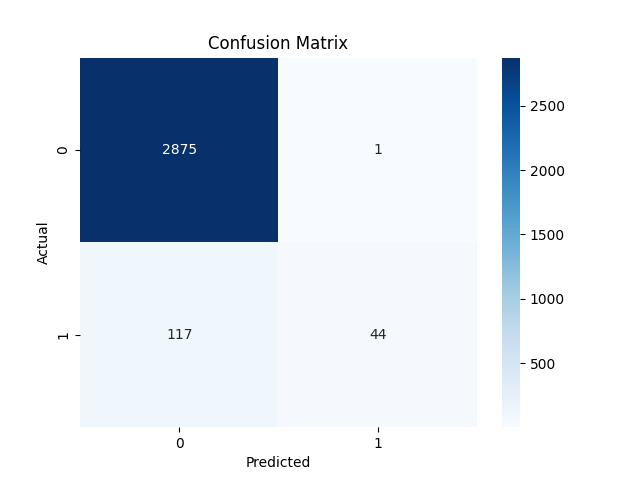

🕵️‍♂️ Fake Job Detection using NLP & Machine Learning

This project focuses on detecting **fake job postings** using **Natural Language Processing (NLP)** and **Machine Learning**. Built as an end-to-end text classification system, it analyzes job listings and classifies them as real or fake using a Logistic Regression model on TF-IDF-transformed data.

🚀 What This Project Does

- Loads and explores a real-world job postings dataset
- Combines job title, description, and requirements into one text column
- Cleans the text (lowercase, removes punctuation, stopwords)
- Converts text into numerical form using **TF-IDF**
- Trains a **Logistic Regression** classifier
- Evaluates model performance using accuracy, precision, recall, and confusion matrix
- Visualizes performance with a heatmap

📊 Technologies Used

- **Python**
- **Jupyter Notebook**
- **pandas**, **numpy** – Data handling
- **NLTK** – Text preprocessing
- **scikit-learn** – TF-IDF, model training, evaluation
- **matplotlib**, **seaborn** – Visualization

🧪 Dataset

This project uses the **Fake Job Postings Dataset** from Kaggle:

🔗 [Fake Job Postings Dataset on Kaggle](https://www.kaggle.com/datasets/shivamb/real-or-fake-fake-jobposting-prediction)

> **Note:**  
To run the notebook locally, download the dataset from the above link and save it as: /data/fake_job_postings.csv
> (The dataset is not uploaded to GitHub to keep the repo lightweight.)

📊 Model Evaluation

The model was evaluated using a test set and the following metrics:

- **Accuracy**
- **Precision**
- **Recall**
- **F1-Score**
- **Confusion Matrix**

📉 Here’s a sample confusion matrix:

  

## 📂 Project Structure

Fake_Job_Detection/
├── data/fake_job_postings.csv                 # Dataset used locally (linked via Kaggle) fake_job_postings.csv
├── notebooks/fake_job_detection.ipynb         # Jupyter notebook with full project code  
├── visuals/confusion_matrix.png               # Confusion matrix and plots
├── README.md                                  # Project overview and documentation

## 🔮 Future Enhancements

- 🔍 Add **Explainable AI** using LIME and SHAP to explain predictions
- 🔁 Train multiple classifiers (Random Forest, XGBoost, etc.)
- 🌐 Deploy a web app using Streamlit
- ✒️ Write a research blog/post about this project

## 🙌 Author

**Prince Singh**  
Final Year B.E. Student – Electronics & Computer Science  
Atharva College of Engineering

📎 [LinkedIn Profile](https://www.linkedin.com/in/prince-singh-b35209368)  
📎 [GitHub Profile](https://github.com/Prince-SinghDS)

