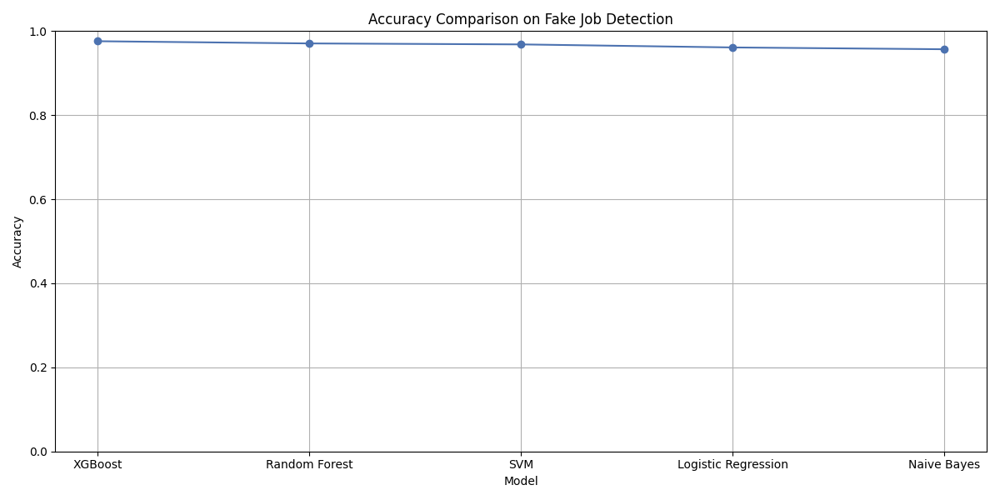
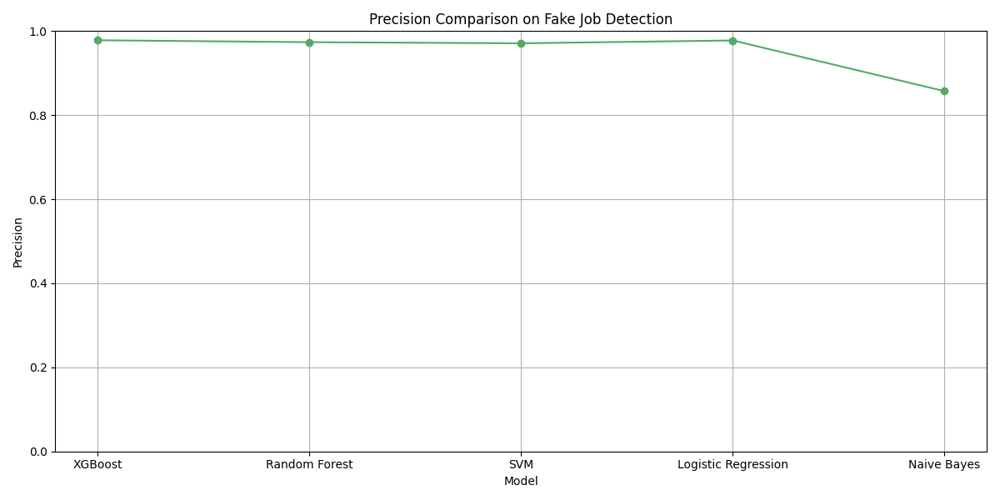
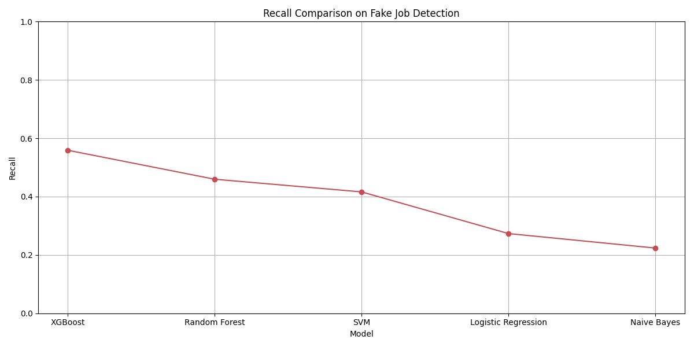
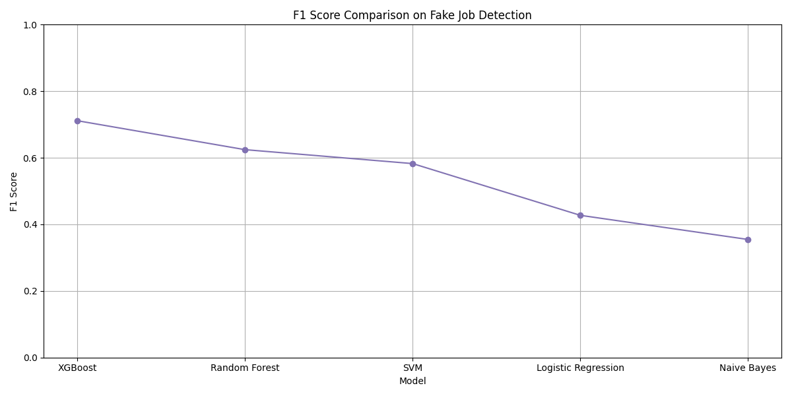
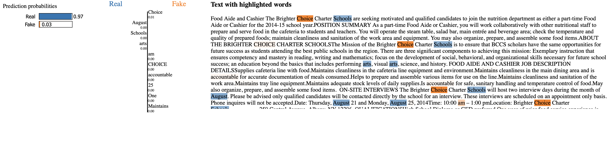
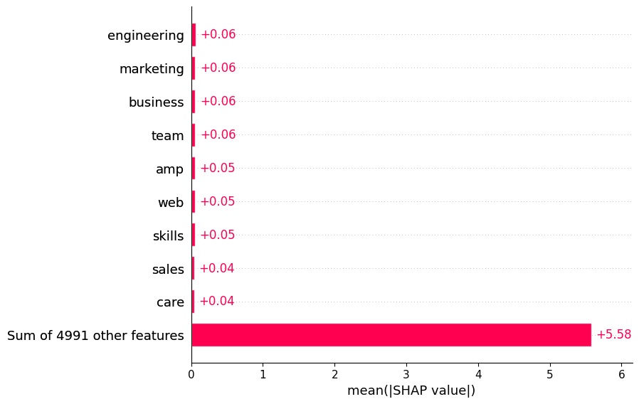
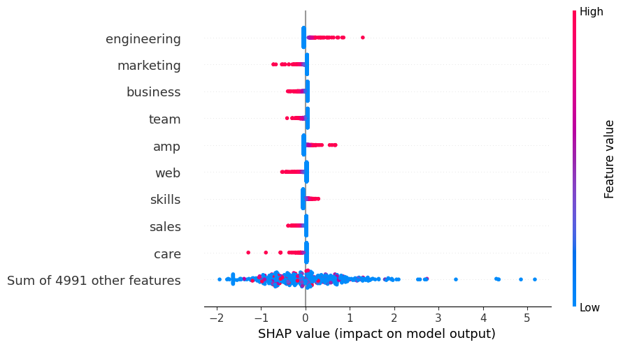
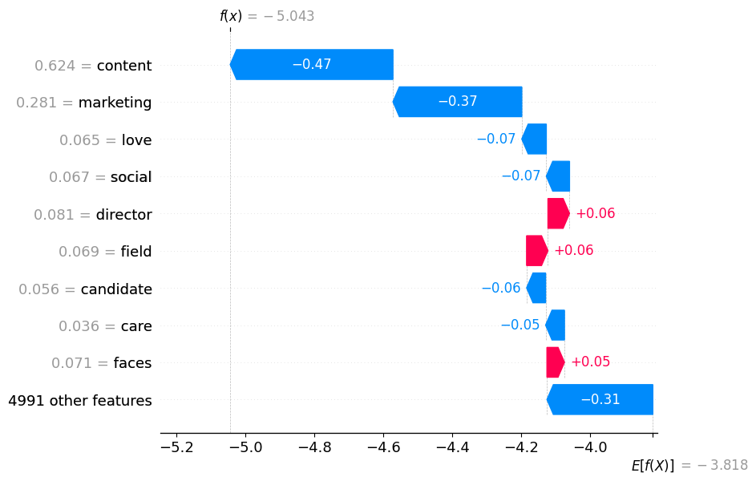
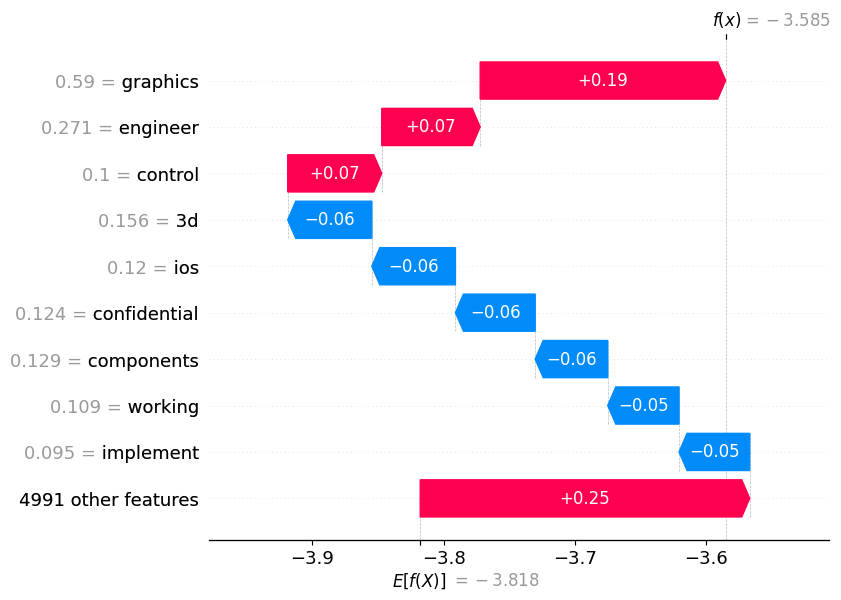

🕵️‍♂️ Fake Job Detection using NLP & Machine Learning

🚀 **Live Now** – SHAP, LIME Added | ✅ Streamlit Web App Deployed
App link🔗 - https://fake-job-detection-nlp.streamlit.app

This project focuses on detecting **fake job postings** using **Natural Language Processing (NLP)** and **Machine Learning**. Built as an end-to-end text classification system, it analyzes job listings and classifies them as real or fake using a Logistic Regression model on TF-IDF-transformed data.

🚀 What This Project Does

- Loads and explores a real-world job postings dataset
- Combines job title, description, and requirements into one text column
- Cleans the text (lowercase, removes punctuation, stopwords)
- Converts text into numerical form using **TF-IDF**
- Trains a **Logistic Regression** classifier
- Evaluates model performance using accuracy, precision, recall, and confusion matrix
- Visualizes performance with a heatmap
- Adds model interpretability using **LIME** and **SHAP**
- Deploys as a interactive *Streamlit Web App*

📊 Technologies Used

- **Python**
- **Jupyter Notebook**
- **pandas**, **numpy** – Data handling
- **XGBoost**
- **NLTK** – Text preprocessing
- **scikit-learn** – TF-IDF, model training, evaluation
- **matplotlib**, **seaborn** – Visualization
- **LIME**, **SHAP** - Model explainability

🧪 Dataset

This project uses the **Fake Job Postings Dataset** from Kaggle:

🔗 [Fake Job Postings Dataset on Kaggle](https://www.kaggle.com/datasets/shivamb/real-or-fake-fake-jobposting-prediction)

> **Note:**  
To run the notebook locally, download the dataset from the above link and save it as: /data/fake_job_postings.csv
> (The dataset is not uploaded to GitHub to keep the repo lightweight.)

📊 Model Evaluation

✅ Best Model: *XGBoost* (after GridSearchCV)
The model was evaluated using a test set and the following metrics :

- **Accuracy**
- **Precision**
- **Recall**
- **F1-Score**
- **Confusion Matrix**

-  Metric       | Score (Tuned XGBoost) |
|--------------|----------------------|
| Accuracy     | 91%+  
| Precision    | ~0.89  
| Recall       | ~0.58  
| F1 Score     | ~0.70  

📊 Model Comparisons

  
  
  
  

📉 Here’s a sample confusion matrix:

  

🧠 Sample LIME Explanation

  

📎 [Download Full Interactive LIME Explanation](visuals/lime_explanation_sample0.html)

🧠 Explainability

This project includes local model interpretation using **LIME (Local Interpretable Model-Agnostic Explanations)**:

- LIME was used to explain individual predictions
- It highlights which words contributed to the model classifying a job posting as **real** or **fake**
- [View Sample LIME Explanation](visuals/lime_explanation_sample0.html)

📊 SHAP (SHapley Additive Explanations)

SHAP takes explainability to the next level — by showing the overall importance of each word across all job posts, and letting us zoom into individual predictions.

What we did:
- Used SHAP’s `LinearExplainer` for Logistic Regression + TF-IDF
- Visualized **global feature importance** with bar & beeswarm plots
- Visualized **individual prediction explanations** with waterfall plots

📊 SHAP Summary Plot

  

🐝 SHAP Beeswarm Plot

  

💧 SHAP Waterfall Plot – Sample 1

  

💧 SHAP Waterfall Plot – Sample 2

  

 📂 Project Structure

Fake_Job_Detection/
├── data/fake_job_postings.csv                 # Dataset used locally (linked via Kaggle) fake_job_postings.csv
├── notebooks/fake_job_detection.ipynb         # Jupyter notebook with full project code  
├── visuals/confusion_matrix.png               # Confusion matrix and plots
├── visuals/lime_explanation_sample0.html      # LIME HTML output for local model explainability
├── visuals/lime_output.png                    # LIME PNG screenshot
├── visuals/shap_summary_plot.png              # SHAP bar plot
├── visuals/shap_beeswarm.png.png              # SHAP beeswarm plot
├── visuals/shap_waterfall_sample1.png         # SHAP waterfall (sample 1)
├── visuals/shap_waterfall_sample2.png         # SHAP waterfall (sample 2)
├── README.md                                  # Project overview and documentation

🌐 Deployed Streamlit App

🖥️ Built with ⁠ Streamlit ⁠, offering:
-  ⁠🎯 Pre-filled Example Job Button
-⁠  ⁠🫆 Predict Button with Confidence Score
-⁠  ⁠📉 Visual Confidence Progress
-  ⁠📄 Download Prediction
-⁠  ⁠📊 SHAP Visuals
-⁠  ⁠🧹 Clear Fields Button

 📸 App Screenshots

  
  

🔗 [Deployed App](https://your-streamlit-app-link)
)

🔮 Future Enhancements

-⁠  ⁠🧠 Integrate advanced models (e.g., BERT, LSTM)
-⁠  ⁠📊 Add ROC-AUC, PR Curves
-⁠  ⁠🌎 Add language detection and multilingual support
-⁠  ⁠📱 Make app responsive on mobile
-⁠  ⁠📝 Publish a blog or academic paper

🙌 Author

**Prince Singh**  
Final Year B.E. Student – Electronics & Computer Science  
Atharva College of Engineering
University of Mumbai

📎 [LinkedIn Profile](https://www.linkedin.com/in/prince-singh-b35209368)  
📎 [GitHub Profile](https://github.com/Prince-SinghDS)

